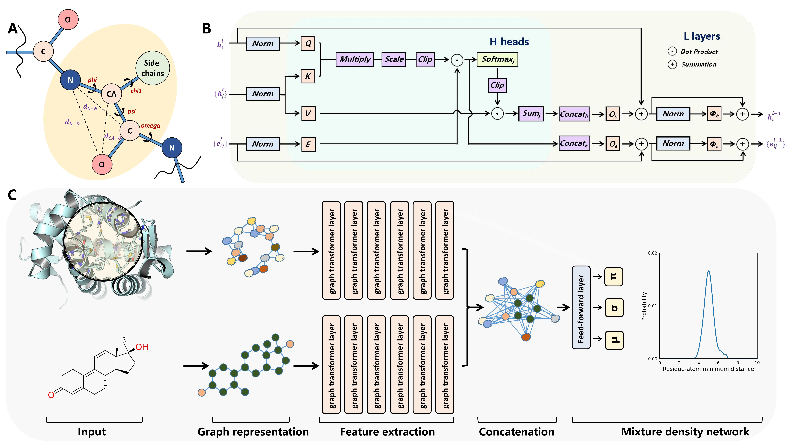

# RTMScore

[RTMScore](https://github.com/sc8668/RTMScore) predicts how well a small molecule (a drug candidate, for instance)
fits into a protein's binding pocket.

<div align=center>

</div>

The original project is built on top of [DGL](https://www.dgl.ai/), a graph learning library.

DGL works well for research, but it's a heavy, Python-only
dependency that doesn't fit naturally into a native, high-performance
pipeline, i.e. the setting this fork targets.

Two deployment paths were built: a pure PyTorch model rewrite that expresses every operation as vectorized tensor math instead of going through DGL (see [`rtmscore_pytorch/`](rtmscore_pytorch/README.md)), and a C++ pipeline paired with a trained model in the ONNX format, compatible with HPC applications (see [`rtmscore_onnx/`](rtmscore_onnx/README.md)).

Both paths depend on a shared trained checkpoint (`trained_models/rtmscore.pth`, by the original authors) and the sample data in `example/`.


## Benchmarks

The three implementations (the original DGL model, the pytorch port,
and the ONNX/C++ version) were benchmarked with the same trained checkpoint. 

The inference results for tests with different environments are reported (in milliseconds) in the tables below. Tests on CPU were performed with multithreading enabled.

For inference on a single sample:

| Implementation | Device | Min | Max | **Median** |
|---|---|---:|---:|---:|
| Original (DGL) | CPU | 23.94 | 30.20 | **25.25** |
| PyTorch port | CPU | 13.81 | 23.50 | **17.24** |
| ONNX Runtime C++ | CPU | 24.11 | 27.27 | **24.68** |
| Original (DGL) | CUDA | 15.99 | 17.26 | **16.24** |
| PyTorch port | CUDA | 7.12 | 8.64 | **7.18** |
| ONNX Runtime C++ | CUDA | 5.40 | 7.68 | **5.42** |

Inference was also tested with respect to different batch sizes, in the CUDA environment:

| Batch Size | DGL | PyTorch | ONNX/C++ |
|---|---:|---:|---:|
| 1  | 16.24 | 7.18 | **5.42** |
| 4  | 4.32 | **2.38** | 5.43 |
| 8  | 2.50 | **1.71** | 5.24 |
| 16 | 1.72 | **1.46** | 5.20 |
| 32 | 1.43 | **1.38** | - |

Tests on the ONNX port of the model fail for `batch_size > 16` because of a limitation in the [cuDNN](https://developer.nvidia.com/cudnn) library (see [here](https://forums.developer.nvidia.com/t/about-limitations-in-data-scale-of-batch-normalization-in-cudnn/265431)).

Several optimization strategies have been tested to try and erase the gap between the ONNX model and the PyTorch model: padding ligand atoms to a fixed size instead of compacting mid-graph, forcing ONNX Runtime's top graph-optimization level, and making that padded model's batch size dynamic. Results are reported in the table below.

| Batch size | ONNX/C++ standard | ONNX/C++ padded | + `--opt-level all` | + dynamic batch size |
|:---|---:|---:|---:|---:|
| 1  | 6.71 | 6.56 | 5.25 | 6.13 |
| 2  | 6.04 | 4.48 | 5.01 | 4.76 |
| 4  | 5.44 | 4.04 | 4.50 | 4.60 |
| 8  | 5.33 | 3.96 | 3.84 | 3.89 |
| 16 | 5.31 | **3.82** | 4.23 | 3.87 |
| 32 | - | - | - | - |

The remaining gap is not due to "slower computation", but rather dispatch overhead: ONNX Runtime still issues far more, smaller GPU operations per call than PyTorch's execution.


## Examples

To try either path against the provided example:

```bash
# pytorch
python rtmscore_pytorch/src/main.py -p example/1qkt_p_pocket_10.0.pdb -l example/1qkt_decoys.sdf

# ONNX/C++
./rtmscore_onnx/build/interaction trained_models/rtmscore.onnx --featurize example/1qkt_p_pocket_10.0.pdb example/1qkt_decoys.sdf
```

Check [`rtmscore_pytorch/README.md`](rtmscore_pytorch/README.md) and
[`rtmscore_onnx/README.md`](rtmscore_onnx/README.md) for more.
